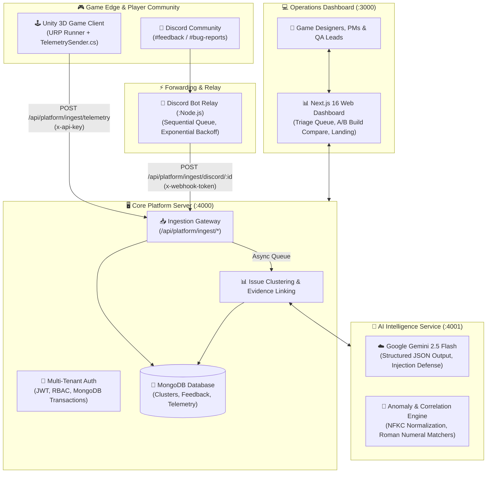

<p align="center">
  
</p>

# 🐶 GoBuster
### AI-Powered Game Analytics & Telemetry Correlation Platform

[](https://nextjs.org/)
[](https://nodejs.org/)
[](https://www.mongodb.com/)
[](https://ai.google.dev/)
[](https://discord.js.org/)
[](https://unity.com/)
[](LICENSE)

> Built for the **Xsolla Baku GameTech Hackathon** by **Team Enthuzone**.

---

## 🌟 Executive Summary

In modern game development, studios suffer from two disconnected silos of player feedback:
1. **Qualitative Noise**: Chaotic player chatter across Discord, Steam reviews, and bug reports that are difficult to categorize, deduplicate, and prioritize.
2. **Quantitative Blindness**: Massive telemetry logs tracking player deaths and quits without explaining *why* players are frustrated.

**GoBuster** bridges this gap. By coupling **Google Gemini 2.5 Flash** with deterministic mathematical correlation engines, the platform ingests live community feedback from Discord alongside real-time gameplay telemetry from Unity 3D, correlates player complaints with empirical dropoff anomalies, and delivers prioritized, evidence-backed issues and actionable patch advice to Game Designers, Product Managers, and QA Leads.

---

## 🏗️ End-to-End System Architecture



---

## 📚 Comprehensive Documentation Hub

All architecture, user flow, API, and setup documentation are organized in the [`docs/`](file:///docs/README.md) hub:

| Component | Technical Scope | Documentation Links |
|:---|:---|:---|
| **🌐 Global Architecture** | System topology, security boundaries, and data pipelines | [System Architecture](file:///docs/system-architecture.md) |
| **🔄 User Journeys** | End-to-end player-to-studio workflows and state machines | [User Flows & Lifecycle](file:///docs/user-flows.md) |
| **🖥️ Core Server** | Hexagonal architecture, REST APIs, and MongoDB schemas | [Server Docs](file:///docs/server/README.md) • [Architecture](file:///docs/server/architecture.md) • [API Reference](file:///docs/server/api-reference.md) • [Data Models](file:///docs/server/data-models.md) |
| **🧠 AI Intelligence** | Gemini 2.5 Flash, structured outputs, and correlation math | [AI Service Docs](file:///docs/ai-service/README.md) • [LLM Architecture](file:///docs/ai-service/architecture.md) • [Correlation Math](file:///docs/ai-service/correlation-engine.md) |
| **🤖 Discord Bot** | Gateway intents, message queues, and backoff relays | [Discord Bot Docs](file:///docs/discord-bot/README.md) • [Setup Guide](file:///docs/discord-bot/setup-guide.md) • [Relay Pipeline](file:///docs/discord-bot/relay-pipeline.md) |
| **🎮 Unity 3D Game** | Game mechanics, scene structure, and C# TelemetrySender | [Game Docs](file:///docs/game/README.md) • [Game Architecture](file:///docs/game/architecture.md) • [Telemetry Sender](file:///docs/game/telemetry-sender.md) |
| **📊 Web Dashboard** | Next.js App Router, operational workspaces, and landing | [Client Docs](file:///docs/client/README.md) • [App Architecture](file:///docs/client/architecture.md) • [UX & Triage Surfaces](file:///docs/client/user-experience.md) |

---

## 🚀 The 5 Core Components & Quick Start

### 1. 🖥️ Core Platform Server (`server/`)
Express.js backend with MongoDB replica-set transactions, multi-tenant RBAC, and ingestion webhooks.
```bash
cd server
npm install
cp .env.example .env
npm start # Runs on http://localhost:4000
```

### 2. 🧠 AI Intelligence Service (`ai-service/`)
Microservice running **Google Gemini 2.5 Flash** for structured JSON classification and deterministic correlation math.
```bash
cd ai-service
npm install
cp .env.example .env # Set GEMINI_API_KEY
npm start # Runs on http://localhost:4001
```

### 3. 🤖 Discord Bot Relay (`discord-bot/`)
Daemon monitoring Discord channels for player feedback and relaying to the Core Server with automatic retries and `🎮` reactions.
```bash
cd discord-bot
npm install
cp .env.example .env # Set DISCORD_BOT_TOKEN
npm start
```

### 4. 🎮 Unity 3D Game Client (`game/`)
Unity URP action-runner game with automated runtime `TelemetrySender.cs` streaming player attempts and abandonment metrics.
- Open `game` in **Unity Hub** (2022.3 LTS or 2023.2+).
- Open `Assets/Scenes/MainScene.unity` and press **Play**.

### 5. 📊 Operations Dashboard & Landing (`client/dashboard/`)
Next.js 16 web application for triage, release validation, A/B build comparison, and product marketing.
```bash
cd client/dashboard
npm install
cp .env.example .env
npm run dev # Runs on http://localhost:3000
```

---

## 💡 How It Works: The 5-Step Intelligence Loop

1. **Player Experience & Feedback**: A player reaches Level 5 in the Unity game, experiences excessive boss HP, fails repeatedly, and quits. Frustrated, the player posts in the studio's Discord: *"Boss in Level V is impossible to beat, HP pool is absurd!"*
2. **Real-time Ingestion**:
   - Unity's `TelemetrySender` emits `attempt` and `quit` events for `level_5` to the Core Server.
   - The Discord Bot picks up the chat message, forwards it via authenticated webhook, and reacts with `🎮`.
3. **AI Classification & Normalization**:
   - The AI Service invokes **Gemini 2.5 Flash** with strict JSON schema outputs: classifies as `Difficulty`, assigns severity `0.88`, and validates authenticity.
   - Normalization converts `"Level V"` to canonical target `"Level 5"`.
4. **Empirical Correlation**:
   - The correlation engine calculates an empirical **42% Abandonment Rate** (anomaly $>30\%$) and **7.4 Average Retries** (anomaly $>5.0$).
   - The issue is tagged as **Supported by Telemetry** with a **94% Confidence Score**, escalating it to **CRITICAL**.
5. **Studio Decision & Patch**:
   - The QA Lead views the paired evidence on `/issues`.
   - Clicks **AI Recommendation**: Gemini suggests: *"Reduce Boss Phase 2 HP by 15-20% and add an intermediate checkpoint."*
   - The studio deploys Build `1.1.0` and uses `/compare` to verify a 65% drop in complaints and a 24% increase in level completion.

---

## 🏆 Hackathon Alignment & Judging Criteria

| Hackathon Criterion | Project Execution |
|:---|:---|
| **Best Project** | Complete, working multi-tier gametech platform spanning Unity, Discord, Express, MongoDB, Gemini LLM, and Next.js. |
| **Best Idea** | Solves the industry-wide problem of siloed analytics by scientifically correlating subjective player text with objective telemetry. |
| **Best Code** | Clean architecture throughout: Ports-and-Adapters in Server, strict Zod schemas, Unicode NFKC normalization, singleton C# design, and Next.js App Router. |
| **Most GitHub Commits** | Rigorous Software Development Life Cycle (SDLC) conventional commit history spanning over 1,000+ atomic commits across client, server, ai-service, and discord-bot. |

---

## 👥 Team Enthuzone

Built with passion for the **Xsolla Baku GameTech Hackathon** (Sept 9–11, 2026).
For questions or inquiries, please refer to the team leads or open an issue in this repository.
