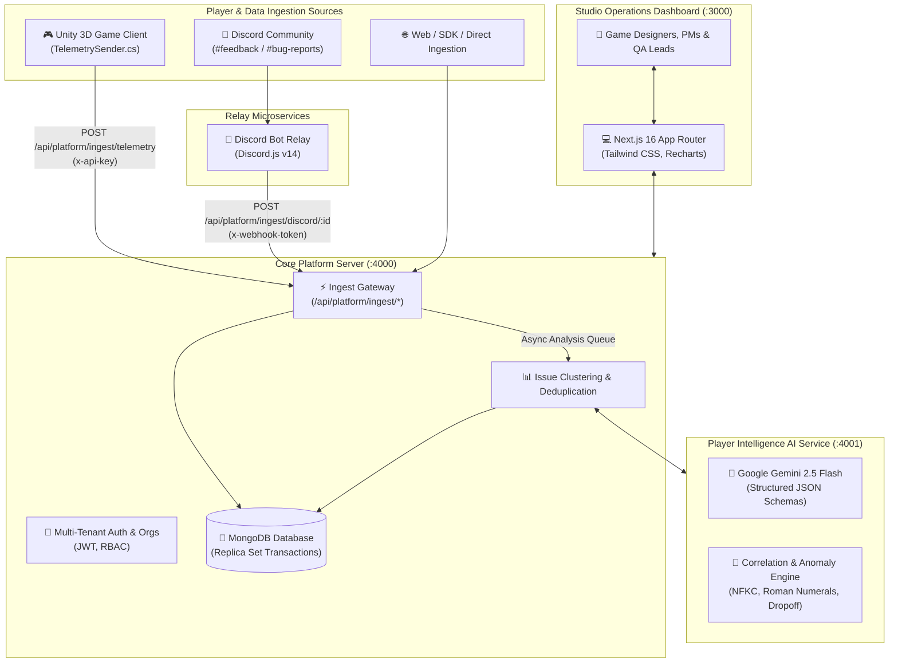

# 📚 Player Issue Intelligence — Documentation Hub

Welcome to the comprehensive documentation suite for **Player Issue Intelligence (Enthuzone)**, an end-to-end game intelligence platform developed for the **Xsolla Baku GameTech Hackathon**.

The platform merges qualitative player sentiment (from Discord, Steam, In-game feedback) with quantitative gameplay telemetry (from Unity 3D game clients), utilizes **Google Gemini 2.5 Flash** and mathematical anomaly engines to detect, classify, correlate, and prioritize game issues, and empowers Game Studios, Product Managers, and QA Leads through an evidence-based operational dashboard.

---

## 🗺️ Documentation Directory Map

```
docs/
├── README.md                      # Documentation Hub & Navigation Index
├── system-architecture.md         # Global End-to-End Architecture & Topology
├── user-flows.md                  # Comprehensive User Journeys & Life Cycle
├── server/                        # Backend Ingestion & Core Platform Service
│   ├── README.md                  # Server Overview & Getting Started
│   ├── architecture.md            # Vertical-Slice Hexagonal Architecture
│   ├── api-reference.md           # Complete REST API Specifications
│   └── data-models.md             # MongoDB Schemas & Multi-Tenancy
├── ai-service/                    # LLM & Mathematical Correlation Microservice
│   ├── README.md                  # AI Service Overview & Getting Started
│   ├── architecture.md            # Gemini 2.5 Flash & Prompt Injection Defense
│   └── correlation-engine.md      # Normalization & Anomaly Correlation Math
├── discord-bot/                   # Standalone Discord Relay Microservice
│   ├── README.md                  # Bot Overview & Core Architecture
│   ├── setup-guide.md             # Discord Portal & Intents Configuration
│   └── relay-pipeline.md          # Message Queue & Exponential Backoff Relay
├── game/                          # Unity 3D Game & Telemetry Client
│   ├── README.md                  # Game Overview & Getting Started
│   ├── architecture.md            # Game Mechanics, Levels & Controls
│   └── telemetry-sender.md        # C# TelemetrySender & Ingestion Protocol
└── client/                        # Next.js 16 Web Dashboard & Landing
    ├── README.md                  # Dashboard Overview & Getting Started
    ├── architecture.md            # Next.js App Router & Component Hierarchy
    └── user-experience.md         # Triage Workspaces, Build Comparison & Landing
```

---

## 🚀 Quick Navigation Matrix

| Component | Technology | Primary Purpose | Documentation Link |
|:---|:---|:---|:---|
| **🌐 System Architecture** | Mermaid, Microservices | End-to-end data pipeline and service interaction topology | [Read Architecture](file:///docs/system-architecture.md) |
| **🔄 User Flows** | State Machines, Journeys | Player reports to AI prioritization and studio triage workflows | [Read User Flows](file:///docs/user-flows.md) |
| **🖥️ Core Server** | Node.js, Express, MongoDB, Zod | Multi-tenant auth, ingestion endpoints, data storage, audit logs | [Server Docs](file:///docs/server/README.md) |
| **🧠 AI Service** | Express, Gemini 2.5 Flash, NFKC | Structured LLM analysis, prompt injection defense, correlation math | [AI Service Docs](file:///docs/ai-service/README.md) |
| **🤖 Discord Bot** | Node.js, Discord.js v14 | Real-time community feedback listener, queue, webhook relay | [Discord Bot Docs](file:///docs/discord-bot/README.md) |
| **🎮 Unity Game** | Unity 3D, C#, URP | Runner game client with automated C# runtime telemetry sender | [Game Docs](file:///docs/game/README.md) |
| **📊 Web Dashboard** | Next.js 16, TypeScript, Tailwind | Operational triage UI, issues view, A/B build comparison, landing | [Client Docs](file:///docs/client/README.md) |

---

## 🏗️ High-Level Service Overview



---

> [!TIP]
> To understand the complete life cycle of an incoming player issue, begin with [docs/user-flows.md](file:///docs/user-flows.md) followed by [docs/system-architecture.md](file:///docs/system-architecture.md).
