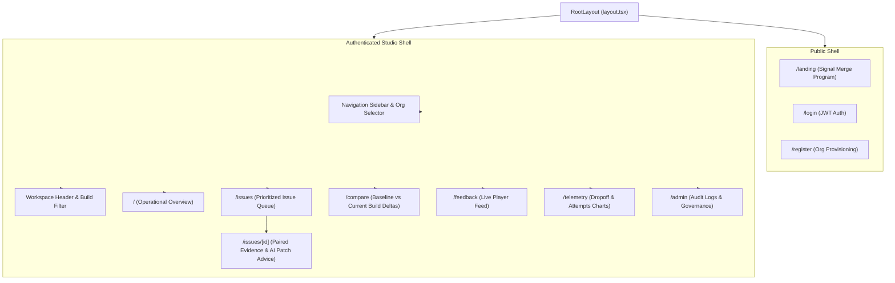

# 🏛️ Web Dashboard Architecture & Component Hierarchy

## 1. Application Layout & Tech Stack

The dashboard is built with the **Next.js 16 App Router**:
- **Framework**: Next.js 16 with Turbopack bundler.
- **Language**: TypeScript with strict mode enabled.
- **Styling**: Tailwind CSS with custom design tokens for game studio analytics.
- **Charts**: Recharts for responsive telemetry graphs, abandonment curves, and issue distribution bars.
- **Icons**: Lucide React for consistent operational iconography.

```
client/dashboard/
├── app/
│   ├── (auth)/
│   │   ├── login/                  # Studio member login
│   │   └── register/               # Organization onboarding
│   ├── admin/                      # Super admin workspace & audit logs
│   ├── bots/                       # Bot relays & live playtest runner
│   ├── compare/                    # A/B release comparison surface
│   ├── feedback/                   # Raw & classified feedback stream
│   ├── issues/                     # Prioritized issues queue & details
│   ├── telemetry/                  # Gameplay telemetry graphs & trends
│   ├── landing/                    # Public product marketing landing
│   ├── layout.tsx                  # Root layout with theme & font providers
│   ├── page.tsx                    # Main operational overview
│   └── globals.css                 # Theme variables & typography
├── components/                     # Reusable UI widgets & analytical cards
└── lib/                            # Typed API clients & session management
```

---

## 2. Component Hierarchy & Information Architecture



---

## 3. Design System Principles

- **Decision-First Layouts**: Critical issues, impact metrics, and affected game builds are displayed before secondary totals.
- **Evidence Pairing**: The UI never displays an opaque "AI score" alone; qualitative feedback quotes from players are displayed side-by-side with quantitative telemetry graphs.
- **Restrained Semantic Palette**:
  - `Critical`: Semantic Red (`#ef4444`)
  - `High`: Semantic Orange (`#f97316`)
  - `Medium`: Semantic Yellow (`#eab308`)
  - `Low`: Semantic Green / Neutral (`#10b981`)
- **Keyboard-Complete Accessibility**: Full focus trapping, Escape dismissal on modal dialogs, and ARIA semantic landmarks.
