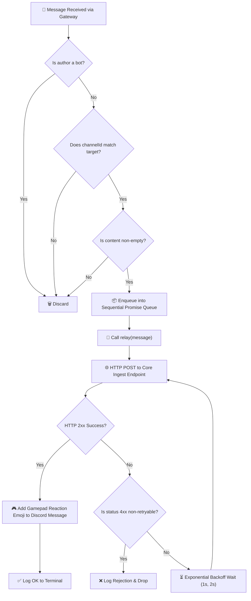

# 🔄 Discord Ingestion & Relay Pipeline

## 1. Message Ingestion Lifecycle



---

## 2. Queue & Concurrency Management

To prevent overwhelming the Core Ingest API during sudden spikes in player activity (e.g. after a game crash affecting hundreds of concurrent players), the bot uses a sequential **Promise Chain Queue**:

```javascript
let queue = Promise.resolve();

bot.on("messageCreate", (message) => {
  // Validate criteria
  if (message.author.bot || message.channelId !== config.DISCORD_CHANNEL_ID || !message.content.trim()) {
    return;
  }

  queue = queue
    .then(() => relay(message))
    .catch((err) => {
      console.error("[Queue Error]:", err.message);
    });
});
```

---

## 3. Exponential Backoff & Retry Logic

Network requests to the Core Platform use `AbortSignal.timeout(65000)` and retry up to 3 times for transient failures:

- **Attempt 1**: Immediate execution.
- **Attempt 2**: If network error or 5xx/429 status occurs, wait $1000 \times 2^0 = 1000\text{ ms}$ (1 second).
- **Attempt 3**: If error persists, wait $1000 \times 2^1 = 2000\text{ ms}$ (2 seconds).
- **Non-retryable statuses**: If the server returns a 4xx error (e.g. 401 Unauthorized or 400 Invalid Payload), retries are aborted immediately to avoid flooding the server with invalid data.

---

## 4. Visual Player Feedback (Reactions)

When a message is successfully confirmed and queued by the Core Platform API:
```javascript
await message.react("🎮");
```
This gives the player immediate, delightful visual confirmation that their feedback has been received and registered by the game studio, closing the community feedback loop.
