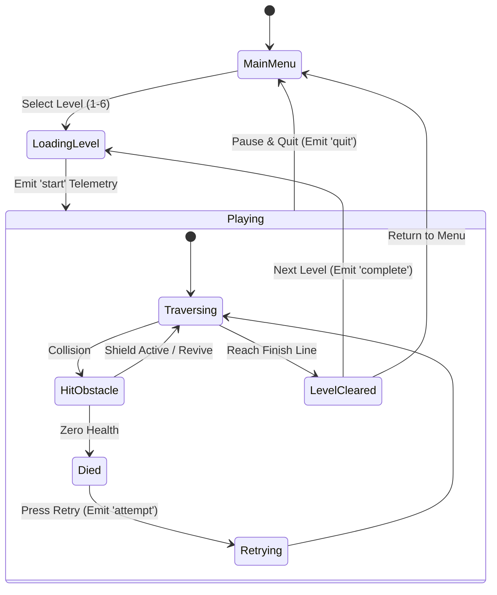

# 🕹️ Unity Game Architecture & Mechanics

## 1. Project Organization

The Unity project is organized into structured domain folders inside `Assets/`:

```
Assets/
├── Telemetry/                      # TelemetrySender.cs client and event schemas
├── Scripts/
│   ├── GameManager/                # Game state transitions (Menu, Playing, GameOver)
│   ├── LevelSystem/                # Progressive level difficulty, checkpoint logic
│   ├── Controls/                   # Input handling and player movement mechanics
│   ├── Obstacles/                  # Dynamic collision traps, hazards and enemies
│   ├── Buffs/                      # Speed boosts, shields, and collectible powerups
│   ├── Camera/                     # Smooth follow camera controllers
│   └── UI/                         # HUD, score indicators, level progress bars
├── Prefabs/                        # Reusable level blocks, obstacles, and player models
├── Sounds/                         # SFX for jumping, impacts, and ambient music
└── Scenes/                         # Main game scenes and tutorial stages
```

---

## 2. Core Gameplay Loop



---

## 3. Level Difficulty Balancing & Telemetry Alignment

The game is designed with progressive challenge across 6 primary stages:
- **Level 1–3**: Introduction to movement, gentle speed curves, wide obstacle spacing.
- **Level 4**: Introduces moving barriers and speed buffs.
- **Level 5**: High-speed narrow pathways, demanding obstacle sequences, designed as a stress test for telemetry detection (high retry and abandonment probability).
- **Level 6**: Climax stage with complex platforming.

When players struggle excessively on Level 5, the telemetry engine captures the spike in `attempt` and `quit` events, allowing the AI correlation engine to detect the difficulty anomaly and alert game designers on the dashboard.
