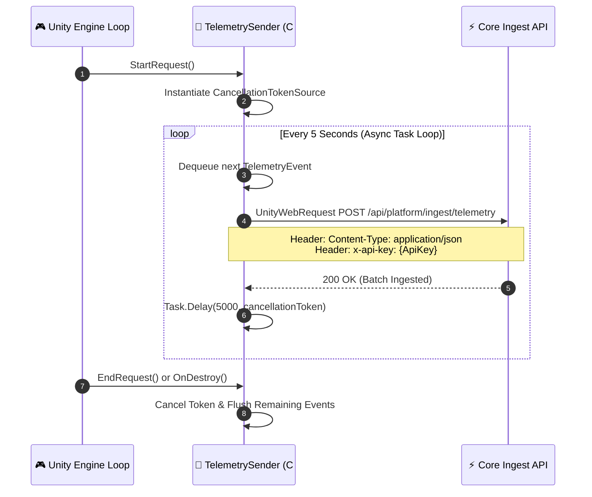

# 📡 C# TelemetrySender & Ingestion Protocol

The `TelemetrySender` class (`Assets/Telemetry/TelemetrySender.cs`) is a persistent Unity `MonoBehaviour` singleton that manages the transmission of gameplay metrics to the Core Platform Ingestion API.

---

## 1. Event Data Schema

Each telemetry record sent from Unity adheres to the following JSON structure:

```csharp
[System.Serializable]
public class TelemetryEvent
{
    public string eventId;     // Unique UUID per event (e.g. "evt-uuid-abc12345")
    public string playerId;    // Persistent player or device identifier ("player-123")
    public string sessionId;   // Ephemeral game session identifier ("session-8821")
    public string target;      // Level or area identifier ("level_1" to "level_6")
    public string eventType;   // "start", "attempt", "complete", "quit", "session_end"
    public int duration;       // Time spent in seconds before event trigger
    public string build;       // Current game client build version (e.g. "1.0.0")
}

[System.Serializable]
public class TelemetryPayload
{
    public List<TelemetryEvent> events;
}
```

---

## 2. Asynchronous Dispatch Architecture

`TelemetrySender` operates asynchronously without stalling the Unity main rendering thread:



---

## 3. Configuration & API Key Binding

In `TelemetrySender.cs`:
```csharp
private const string ApiUrl = "http://127.0.0.1:4000/api/platform/ingest/telemetry";
private const string ApiKey = "your_workspace_api_key_here";
```
For production builds, the endpoint and key can be bound dynamically via Unity's `ScriptableObject` or a runtime config JSON file loaded from `Application.streamingAssetsPath`.
