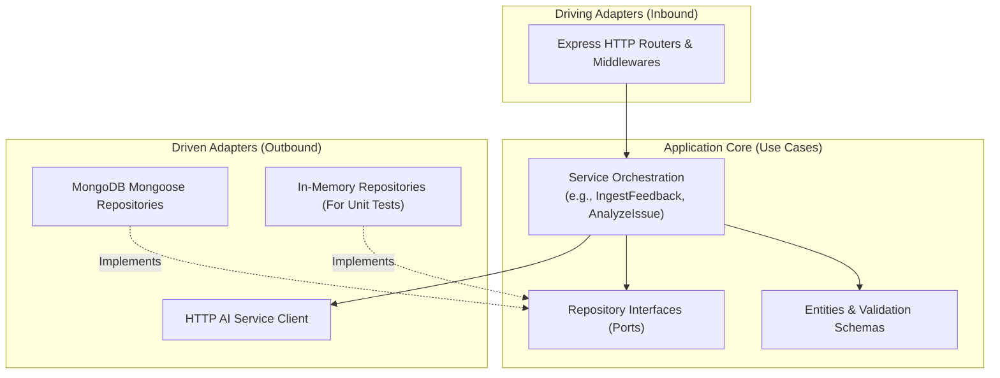

# 🏛️ Core Platform Server Architecture

## 1. Architectural Philosophy

The Core Platform Server follows a **Vertical-Slice Hexagonal (Ports & Adapters)** design pattern. Rather than organizing code by technical layers (controllers, models, services), code is segregated by business capabilities:

```
src/
├── config/                         # Strongly typed environment configuration
├── infrastructure/
│   └── database/                   # MongoDB connection lifecycle & health
├── modules/
│   ├── auth/                       # Registration, login, JWT & authorization
│   ├── organization/               # Multi-tenant organization aggregate
│   ├── user/                       # User management & bcrypt password security
│   ├── feedback/                   # Raw feedback domain & mongo adapter
│   ├── telemetry/                  # Gameplay telemetry domain & mongo adapter
│   └── platform/                   # Operational platform router, ingestion, AI client
├── shared/
│   ├── errors/                     # Centralized AppError hierarchy
│   ├── http/middleware/            # Rate limiter, role auth, validation
│   └── utils/                      # Cryptographic helpers, timing safe checks
├── app.js                          # Express application assembly
└── server.js                       # Node.js process bootstrapper
```

---

## 2. Ports and Adapters (Hexagonal Boundaries)

Dependencies point inward. Business logic and use-cases do not import database drivers directly:



---

## 3. Core Modules Breakdown

### 3.1. Auth & Organization Module
- **Tenant Isolation**: Every organization is an isolated boundary with a unique identifier (`organizationId`).
- **Atomic Registration**: When a new studio creates an account, `User` and `Organization` are committed inside an atomic MongoDB session.
- **RBAC**: Supports `OWNER`, `ADMIN`, `MEMBER`, and `SUPER_ADMIN`. Roles are verified via `requireAnyRole([...])` and `requireSuperAdmin` middleware.

### 3.2. Platform Ingest Module (`src/modules/platform`)
- **Direct Webhook Ingest**: Exposes endpoints for Discord bot relays, Unity telemetry clients, and direct HTTP APIs.
- **Token Verification**: Uses `crypto.timingSafeEqual` to avoid timing attacks when comparing webhook tokens and bearer tokens.
- **Rate Limiting**: Built-in sliding window rate limiter protects endpoints against volumetric floods.
- **Asynchronous AI Hook**: Ingested feedback is written immediately with `analysisStatus: "pending"`, and an asynchronous background loop claims and forwards batches to the AI service without blocking the player's connection.

### 3.3. Issue Clustering Engine
- Grouping occurs on `(workspaceId, type, target)`.
- Updates issue severity, confidence score, and candidate count as new feedback items arrive.
- Maintains a list of qualitative feedback evidence and quantitative telemetry correlations.

---

## 4. Error Handling Strategy

1. **Centralized Error Middleware**: All errors are routed through a unified Express error handler.
2. **Operational vs Programmer Errors**:
   - `AppError` subclasses represent known client issues (400 Bad Request, 401 Unauthorized, 403 Forbidden, 404 Not Found, 429 Rate Limit) and return structured JSON: `{ "error": { "code": "INVALID_CREDENTIALS", "message": "..." } }`.
   - Uncaught exceptions return standard 500 Internal Server Error, logging the stack trace without leaking sensitive internals to clients.
