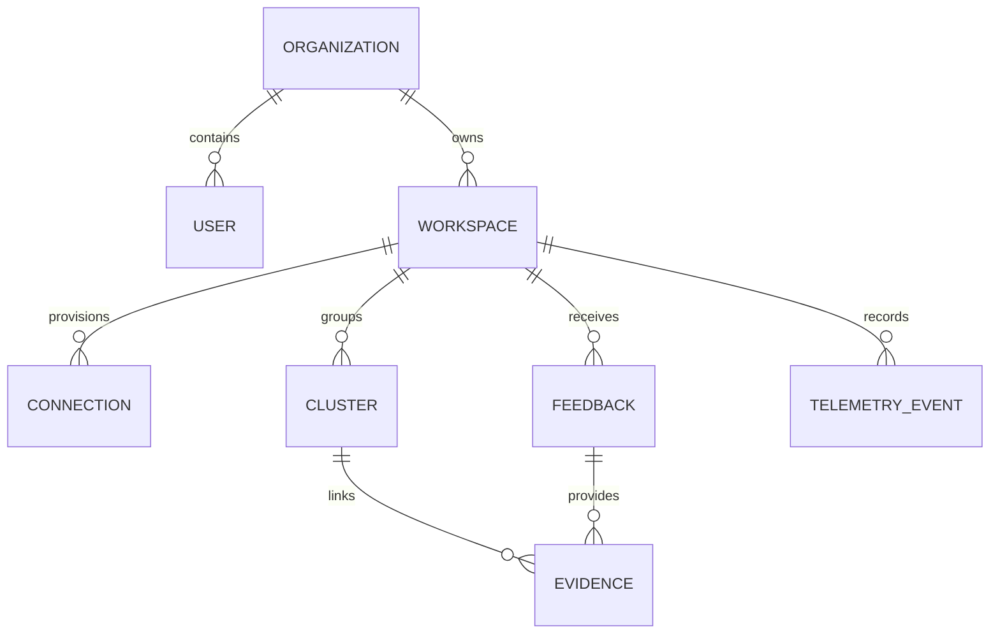

# 🍃 Core Platform Server — Data Models & Schemas

The Core Server uses **MongoDB** as its primary persistence engine. Data isolation, tenant partitioning, and query performance are guaranteed through compound unique indexes and strict Mongoose schemas.

---

## 1. Entity-Relationship Diagram

---

## 2. Primary Collections & Schemas

### 2.1. `organizations`
Represents a gaming studio account.
- `id` (String, UUID, unique index)
- `name` (String, 2-120 chars)
- `slug` (String, unique index)
- `status` (Enum: `ACTIVE`, `SUSPENDED`)
- `createdAt`, `updatedAt` (Timestamps)

### 2.2. `users`
Represents team members belonging to an organization.
- `id` (String, UUID, unique index)
- `organizationId` (String, ref to organizations, indexed)
- `email` (String, lowercase, globally unique index)
- `passwordHash` (String, bcrypt 12-round hash)
- `role` (Enum: `OWNER`, `ADMIN`, `MEMBER`, `SUPER_ADMIN`)
- `status` (Enum: `ACTIVE`, `DISABLED`)

### 2.3. `workspaces`
Operational unit for a game or title.
- `id` (String, UUID, unique index)
- `organizationId` (String, indexed)
- `name` (String)
- `gameUrl` (String, validated HTTPS URL)
- `settings` (Object: telemetry retention, alert thresholds)

### 2.4. `connections`
Credentials and webhooks for data sources.
- `id` (String, UUID, unique index)
- `workspaceId` (String, indexed)
- `type` (Enum: `DISCORD`, `STEAM`, `TELEMETRY`, `WEBHOOK`)
- `apiKey` (String, hashed or encrypted)
- `webhookToken` (String, hashed sha256)
- `status` (Enum: `ACTIVE`, `PAUSED`, `REVOKED`)

### 2.5. `clusters` (Issues)
Aggregated problem reports derived from AI analysis and telemetry.
- `id` (String, UUID, unique index)
- `workspaceId` (String, indexed)
- `type` (Enum: `Difficulty`, `Bug`, `UX`, `Performance`, `Economy`)
- `target` (String, normalized identifier, e.g. `Level 5`)
- `summary` (String)
- `severity` (Number, 0.0 - 1.0)
- `confidence` (Number, 0.0 - 1.0)
- `authenticity` (Enum: `AI Approved`, `Needs Review`, `Likely Spam`)
- `status` (Enum: `OPEN`, `IN_PROGRESS`, `RESOLVED`, `IGNORED`)
- **Index**: Unique Compound Index on `{ workspaceId: 1, type: 1, target: 1 }`

### 2.6. `feedback`
Individual player reports.
- `id` (String, UUID, unique index)
- `workspaceId` (String, indexed)
- `connectionId` (String, indexed)
- `author` (String)
- `text` (String, up to 6000 chars)
- `analysisStatus` (Enum: `pending`, `processing`, `completed`, `failed`)
- `candidate` (Embedded Object from AI output)
- `createdAt` (Date, indexed)

### 2.7. `telemetry_events`
In-game behavioral telemetry stream.
- `eventId` (String, unique index)
- `workspaceId` (String, indexed)
- `playerId` (String, indexed)
- `sessionId` (String, indexed)
- `target` (String, indexed)
- `eventType` (Enum: `start`, `attempt`, `complete`, `quit`, `session_end`)
- `duration` (Number, seconds)
- `build` (String, e.g. `1.0.0`, indexed)
- `timestamp` (Date, indexed)
