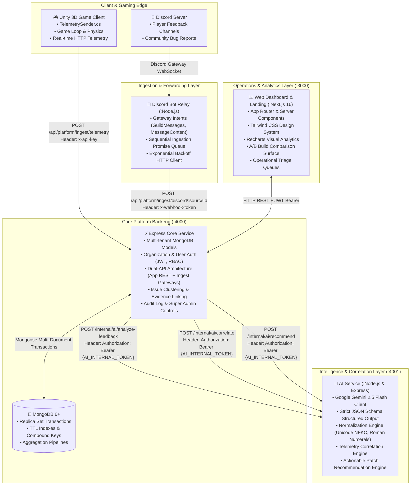
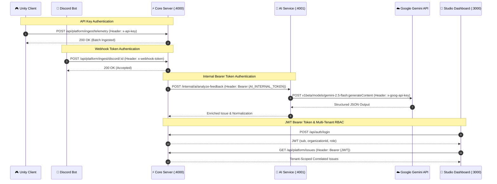

# 🌐 System Architecture & Topology

## 1. Executive Summary

**GoBuster** is an enterprise-grade gametech platform that converges qualitative player sentiment with quantitative in-game telemetry. It bridges the gap between what players *say* (in Discord, Steam, Reddit, and in-game feedback) and what players *experience* (crashes, frame drops, high abandonment rates, spike in retries, low completion rates).

By coupling **Google Gemini 2.5 Flash** with deterministic mathematical correlation engines, the system transforms raw unorganized noise into actionable, prioritized issues with inspectable evidence.

---

## 2. Global Service Topology

The platform comprises five dedicated microservices and applications:

---

## 3. Port & Network Allocation Matrix

| Service | Port | Protocol | Default Bind | Public Exposure | Description |
|:---|:---|:---|:---|:---|:---|
| **Web Dashboard** | `3000` | HTTP / WS | `0.0.0.0:3000` | Public / Edge | Next.js 16 Web Dashboard & Marketing Landing |
| **Core Platform Server** | `4000` | HTTP | `0.0.0.0:4000` | Public API & Ingest | Multi-tenant REST API, Ingest Webhooks, Auth |
| **AI Intelligence Service** | `4001` | HTTP | `0.0.0.0:4001` | Internal Only (VPC) | Gemini 2.5 Flash runner, normalization engine |
| **Discord Bot Relay** | N/A | WSS / Outbound HTTP | Outbound | None (Daemon) | Discord Gateway listener, pushes to Core API |
| **MongoDB Database** | `27017` | MongoDB Wire | `127.0.0.1:27017` | Private / Internal | Primary database storage with replica set support |
| **Unity Game Client** | N/A | Outbound HTTP | Standalone App | Client Binary | Sends player behavior telemetry events |

---

## 4. End-to-End Data Pipelines

### 4.1. Feedback Ingestion & AI Enrichment Pipeline

1. **Capture**: A player posts a message in Discord (`"Boss in Level V has way too much HP and crashes the game"`).
2. **Relay**: The Discord Bot picks up `messageCreate`, validates that it is not a bot message, sanitizes length (up to 6000 chars), and sends a POST request to Core Server's `/api/platform/ingest/discord/:sourceId` using the authenticated `x-webhook-token`.
3. **Receipt & Acknowledgement**: Core Server validates token against the registered Connection, persists the raw feedback document with `analysisStatus: "pending"`, and immediately returns HTTP 200 to the relay. The Discord bot reacts with `🎮` on Discord.
4. **Asynchronous Analysis Queue**: Core Server asynchronously claims pending feedback (`analysisStatus: "processing"`), fetches active cluster targets from MongoDB, and calls AI Service at `POST /internal/ai/analyze-feedback`.
5. **LLM Extraction**: AI Service invokes **Google Gemini 2.5 Flash** with strict JSON schema enforcement and system instructions preventing prompt injection. Gemini extracts:
   - `type`: `Difficulty`, `Bug`, `UX`, `Performance`, or `Economy`.
   - `target`: Clean identifier (`"Level 5"`).
   - `severity`: Normalized 0.0 to 1.0 score.
   - `confidence`: Normalized 0.0 to 1.0 score.
   - `authenticity`: `AI Approved`, `Needs Review`, or `Likely Spam`.
6. **Normalization Engine**: AI Service applies Unicode NFKC normalization, strips punctuation, and maps Roman numerals (`Level V` ➔ `Level 5`).
7. **Cluster Aggregation**: Core Server groups the enriched feedback into a `Cluster` (Issue), updating candidate count, average severity, and sentiment metrics.

### 4.2. Telemetry Ingestion & Anomaly Correlation Pipeline

1. **Game Emission**: Unity 3D `TelemetrySender.cs` emits batch events (`start`, `attempt`, `complete`, `quit`, `session_end`) with target identifier (`level_5`), build version (`1.0.0`), and duration.
2. **Ingest Endpoint**: Core Server validates the game's `x-api-key` and bulk inserts telemetry events into the `telemetry_events` collection.
3. **Session Aggregation**: Telemetry events are rolled up into metrics per target:
   - **Abandonment Rate**: `(quits / starts) * 100` (Anomaly threshold: $\ge 30\%$).
   - **Average Attempts**: `attempts / sessions` (Anomaly threshold: $\ge 5.0$).
   - **Completion Rate**: `(completes / starts) * 100` (Anomaly threshold: $\le 35\%$).
4. **Correlation Calculation**: When triaging an issue, Core Server evaluates the issue's target telemetry metrics against known failure reasons. If high abandonment, excessive retries, or low completion match the qualitative feedback complaints, a high **Correlation Confidence Score** is computed, confirming that qualitative player pain matches measurable quantitative telemetry reality.

---

## 5. Security & Authentication Boundaries

### Security Layers:
1. **Studio Web Users**: JWT tokens signed with `HS256`, 15-minute expiration, containing tenant identifier (`organizationId`) and role (`OWNER`, `ADMIN`, `MEMBER`, `SUPER_ADMIN`). All tenant queries strictly enforce `organizationId: req.auth.organizationId`.
2. **Discord Bot Relay**: Protected via secret `DISCORD_WEBHOOK_TOKEN` passed in `x-webhook-token` header, validated in constant time using `crypto.timingSafeEqual`.
3. **Unity Game Telemetry**: Protected via secret `x-api-key` generated inside the studio's workspace settings.
4. **Internal AI Microservice**: Protected via `AI_INTERNAL_TOKEN` with minimum 32-character requirement and constant-time bearer validation. Never exposed publicly to the internet.
5. **Input Sanitation & Schema Validation**: Every incoming HTTP payload across all services is strictly validated using **Zod** schemas, discarding unexpected properties and enforcing size limits.
