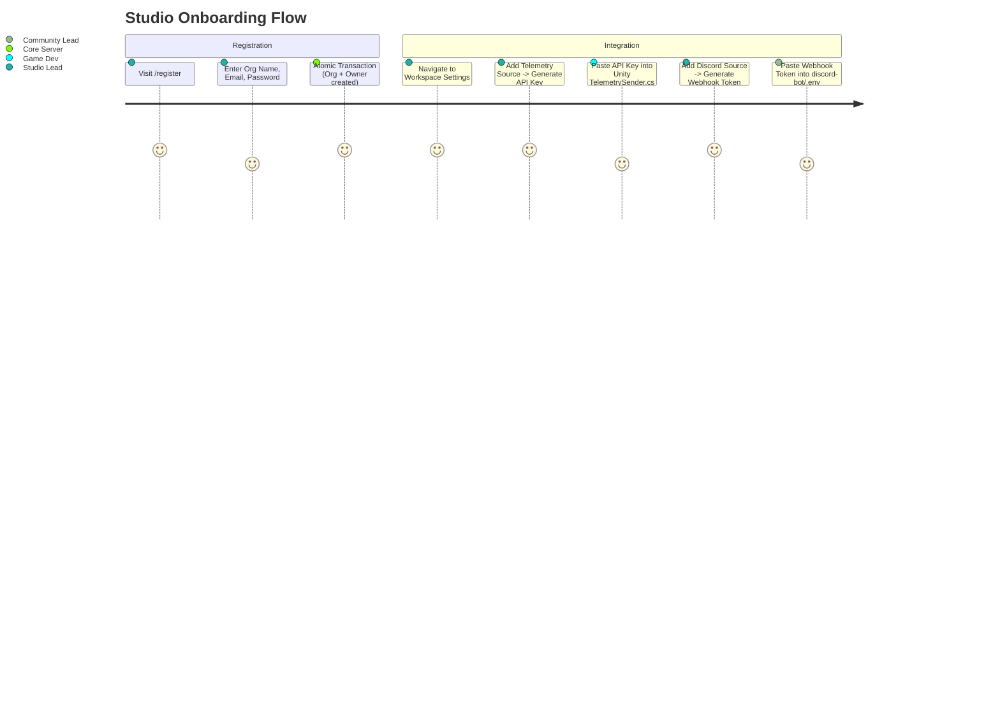
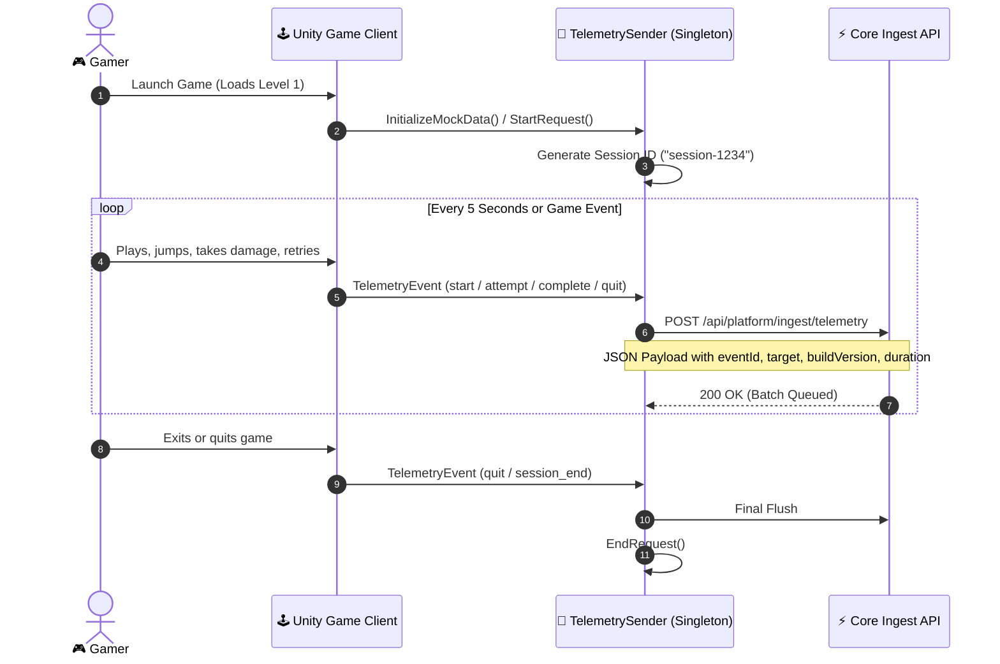
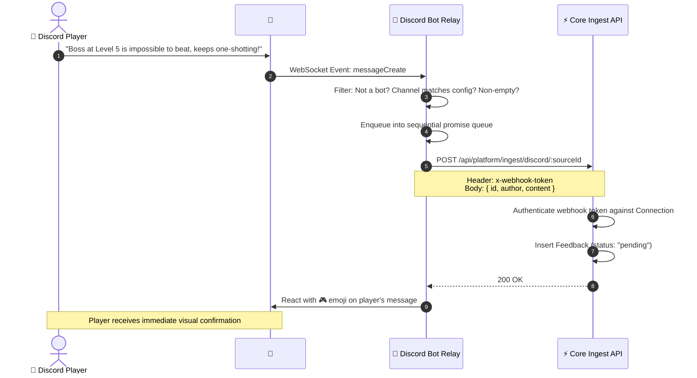
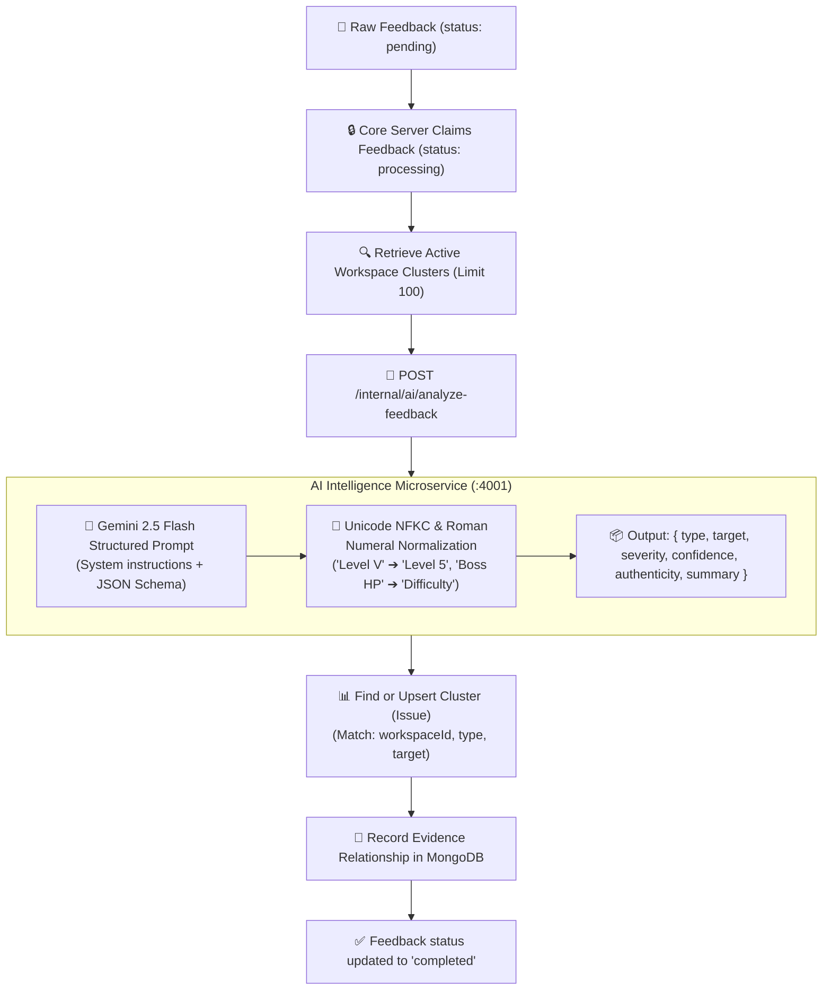
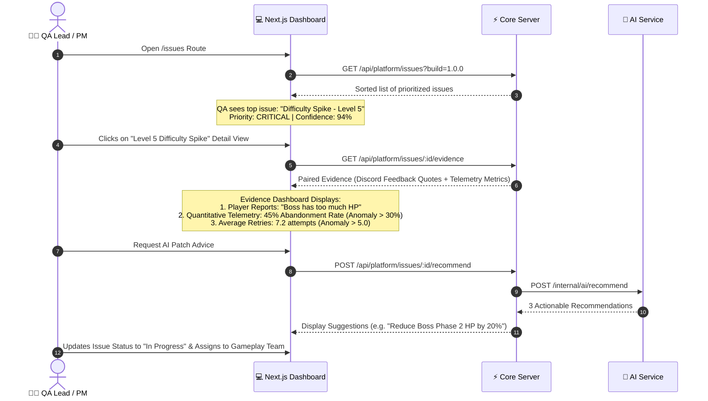
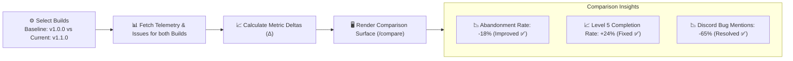

# 🔄 End-to-End User Flows & Journeys

This document outlines the complete behavioral flows, state transitions, and step-by-step user journeys across the **Player Issue Intelligence (Enthuzone)** platform.

---

## 1. Studio Onboarding & Integration Setup

### Step-by-Step:
1. **Account Creation**: The Studio Lead registers at `/register`.
2. **Transaction**: The server runs an atomic MongoDB replica-set transaction creating an `Organization` and a `User` with `OWNER` role.
3. **Workspace Initialization**: Default workspace is provisioned with default retention and build tracking rules.
4. **Source Connections**:
   - The Studio Lead creates a **Unity Telemetry** source, generating a unique `x-api-key`.
   - The Studio Lead creates a **Discord Relay** source, generating a unique `sourceId` and `x-webhook-token`.
5. **Client Configuration**:
   - `x-api-key` is configured in Unity's `TelemetrySender.cs`.
   - `DISCORD_SOURCE_ID` and `DISCORD_WEBHOOK_TOKEN` are configured in `discord-bot/.env`.

---

## 2. In-Game Gameplay & Telemetry Emission Flow

---

## 3. Community Feedback Ingestion Flow (Discord)

---

## 4. AI Categorization, Deduplication & Clustering Flow

---

## 5. Product Manager & QA Lead Issue Triage Flow

---

## 6. A/B Release Validation & Build Comparison Flow

---

## 7. Super Admin Governance & Audit Logging Flow

All high-impact administrative actions across the platform are automatically audited:
1. **Actor Recording**: Captures `userId`, `organizationId`, and role.
2. **Action Classification**: Records action type (`WORKSPACE_CREATE`, `CONNECTION_DELETE`, `KEY_ROTATION`, `ISSUE_RESOLVE`).
3. **Immutability**: Audit logs are written to an append-only collection (`audit_logs`) and exposed only to users with the `SUPER_ADMIN` role at `/admin`.
